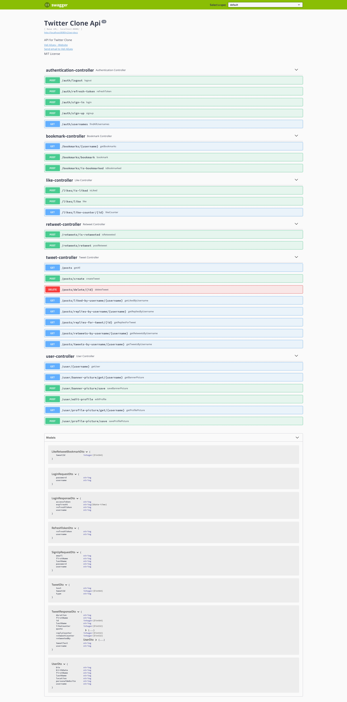

# Twitter Clone
This project is made with Spring Boot and Angular.
You can watch demo [Here](https://drive.google.com/file/d/1gd3aFiOl4y7Gwu7uUm1yL0vwehWebRWF/view?usp=sharing)

# Technologies
Spring Boot 2.7.0

Angular 14

MySql 8.0
# Features

## Home page
User can view all posts stored in database, create new tweet via tweet form, retweet, reply or quote via overlay forms, like and bookmark a tweet.

## Post Page
This page opens when user clicks on a post. Here user can view the post and all replies to it and create a reply via reply form.

## Profile Page
In this page User can update his personal information such as name, bio, location, personal website and birthdate. 
Also, He/She can upload a profile picture and a banner picture. Additionally, user can view his/her tweets, replies, retweets and liked tweets via respective tabs.

## Bookmarks Page
Here user can view his bookmarked tweets.

# Swagger

